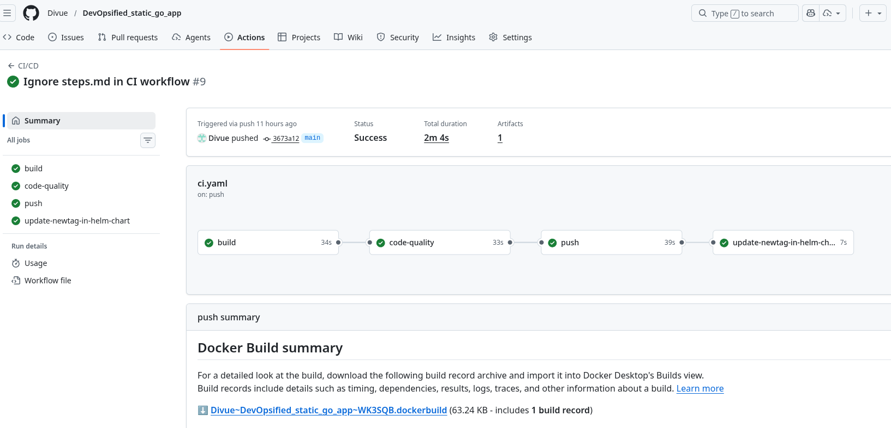
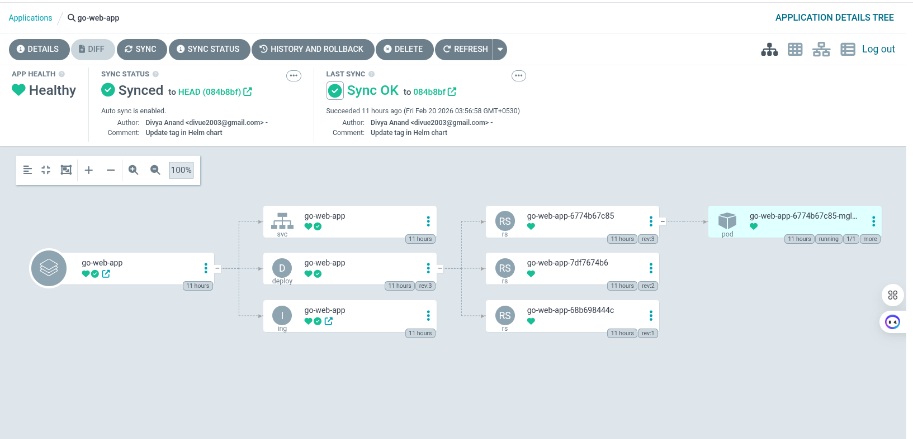
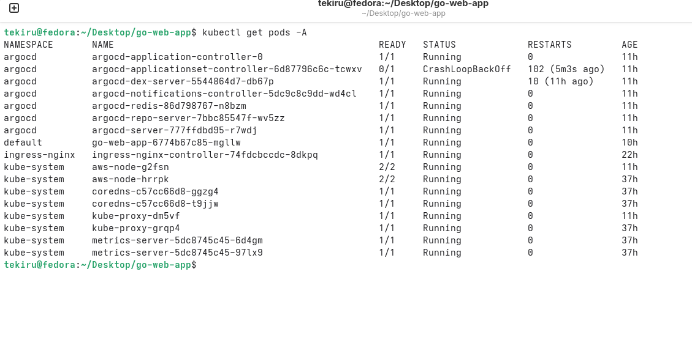
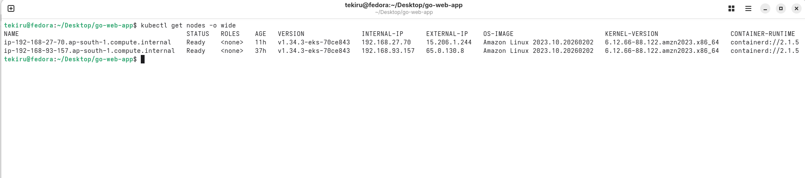

# DevOpsified Go Web Application (EKS + GitOps)

This project demonstrates how a simple Go web application can be deployed using production-style DevOps practices including containerization, CI/CD automation, GitOps, Helm, and Kubernetes deployment on AWS EKS.

Instead of manually deploying a Go app, this repository shows a complete automated pipeline from code push to production deployment.

---

# Architecture

See detailed architecture diagram:

docs/architecture.md

High-level flow:

Developer → GitHub → CI builds Docker image → pushes to registry → updates Helm chart → ArgoCD detects change → syncs to EKS → Ingress exposes application → User accesses via Load Balancer

---

# Tech Stack

- Go (net/http)
- Docker (multi-stage, distroless image)
- Kubernetes
- Helm
- AWS EKS
- GitHub Actions
- ArgoCD (GitOps)
- NGINX Ingress Controller

---

# What This Project Implements

## 1. Containerization

- Multi-stage Docker build
- Minimal distroless runtime image
- Reduced attack surface
- Small image size
- Application exposed on port 8080

---

## 2. Kubernetes Deployment

- Deployment resource
- Service (ClusterIP)
- Ingress configuration
- Helm chart for parameterized deployments
- Deployed to AWS EKS cluster

---

## 3. CI Pipeline (GitHub Actions)

On every push to main:

- Build Go binary
- Run unit tests
- Run golangci-lint
- Build Docker image
- Push image to DockerHub
- Update Helm chart image tag automatically

CI Proof:

---

## 4. GitOps Continuous Deployment (ArgoCD)

- ArgoCD watches the repository
- When Helm tag changes, ArgoCD detects drift
- Automatically syncs application to EKS cluster
- Declarative deployment model

ArgoCD Proof:

---

## 5. Kubernetes Cluster Evidence

All pods running:

EKS worker nodes:

---

## 6. Application Exposure

- Ingress resource configured
- AWS Load Balancer created
- Application accessible externally

App UI:

---

# CI/CD + GitOps Flow (Detailed)

1. Developer pushes code to GitHub
2. GitHub Actions pipeline starts
3. Application is built and tested
4. Docker image is built using multi-stage Dockerfile
5. Image pushed to DockerHub
6. CI updates Helm chart image tag using run ID
7. Commit is pushed back to repository
8. ArgoCD detects repository change
9. ArgoCD syncs application state to EKS
10. Kubernetes performs rolling update
11. Ingress exposes updated version via Load Balancer

This completes a full GitOps deployment loop.

---

# Running Locally

Run without Docker:
go run main.go
access ti on : http://localhost:8080/courses

# Optional: Recreate EKS Cluster 
eksctl create cluster --name demo-cluster --region ap-south-1 --nodes 2

Install ArgoCD:

kubectl create namespace argocd
kubectl apply -n argocd -f https://raw.githubusercontent.com/argoproj/argo-cd/stable/manifests/install.yaml

# Key DevOps Concepts Demonstrated

- Multi-stage Docker builds
- Distroless container runtime
- Kubernetes Deployments and Services
- Ingress + AWS Load Balancer
- Helm templating
- GitHub Actions CI automation
- Image tagging strategy
- GitOps deployment model with ArgoCD
- Cluster scaling and troubleshooting
- Node capacity debugging

---

# Resume Impact

This project demonstrates:

- Real cloud deployment on AWS EKS
- End-to-end CI/CD pipeline
- GitOps workflow implementation
- Infrastructure troubleshooting skills
- Production-style deployment architecture

---
